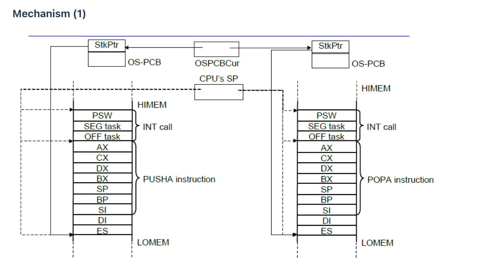
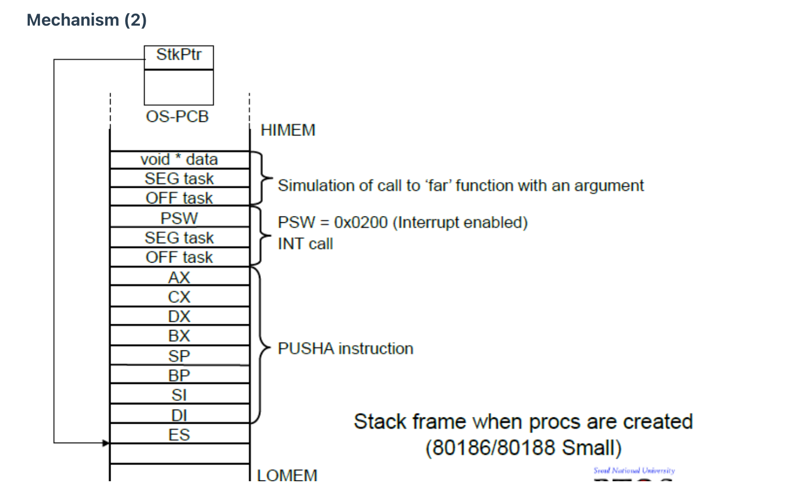

# 컨텍스트 스위칭 시에는 어떤 일들이 일어나나요?

문맥교환은  처리기를 한 프로세스에서 다른 프로세스로 넘겨주는 과정입니다. 수행되던 프로세스가 커널에 진입하여 현재 사용자 모드 스택과(ESP) 명령어 포인터 (EIP == PC)의 값이 해당 커널 모드 스택에 저장되며, CPU는 커널 모드로 전환합니다. ( 다른 레지스터 값들과 플래그들도 저장 ) 커널 모드에서 문맥 교환을 할 때는 스케쥴러를 통해 다음 프로세스를 고르고 현재 스택 포인터 값을 PCB에 저장하고 다음 프로세스 PCB에서 이전에 저장된 스택 포인터를 불러옵니다. 만약 두 프로세스가 같은 가상 메모리 공간을 공유하지 않으면 페이지 테이블도 전환됩니다.

1. 프로그램카운터(PC)와 다른 레지스터들을 포함한 문맥을 저장합니다.
2. 현재 수행 상태에 있는 프로세스의 제어 블록(PCB)을 갱신합니다. 그 프로세스는 수행 상태가 아닌 다른 상태 중 하나로 전이됩니다. 상태변화 이유와 과금 정보를 포함하여 갱신됩니다.
3. 프로세스 제어 블록을 적절한 큐로 옮깁니다(준비큐, 이벤트에 대한 블록큐, 등)
4. 다음에 수행시킬 다른 프로세스를 선택합니다(스케줄링)
5. 선택된 프로세스의 PCB를 갱신하며 프로세스가 수행 상태가 됩니다.
6. 메모리 관리와 관련된 자료구조가 갱신됩니다. 이것은 주소 변환이 어떻게 관리되는가에 따라 요구되지 않을 수 있습니다.
7. 선택된 프로세스가 이전의 수행상태에서 사용하였던 처리기의 문맥을 복원합니다. 이는 이전에 저장하였던 처리기 문맥을 처리기로 적재하는 것입니다.

→ 단순 모드 전환(시스템 콜)과 다르게 상태 전이를 포함한 교환은 상당히 많은 작업을 요구합니다.(컨텍스트 스위칭 시 무조건 시스템 콜이 발생)

## 프로세스와 스레드는 컨텍스트 스위칭이 발생했을 때 어떤 차이가 있을까요?
- 프로세스 스위칭은 주소 공간을 전환하고 **TLB 초기화가 필요하지만 ( TLB flush = 가상→물리 주소 변환 캐시를 무효화하는 것 )**

  TLB: 활성 프로세스의 페이지 테이블을 새로 로드하고 CPU가 바라보는 논리적 주소가 물리 메모리의 영역으로 매핑시켜주는 것입니다.

  (TLB는 MMU - memory management unit 의 일종)

  TLB Flush는 프로세스가 사용하는 주소가 다르기 때문에 이전의 정보를 다 지우고 다시 캐싱해야하기 때문에 오버헤드가 될 수 있습니다.

- 스레드의 컨텍스트 스위칭은 주소 공간을 공유하기 때문에 레지스터&PC 및 스택 상태만 교체하면 됩니다.

## 컨텍스트 스위칭이 발생할 때, **기존의 프로세스 정보는 커널스택에 어떠한 형식**으로 저장되나요?

하드웨어적: 커널 스택에 즉시 프로그램 카운터, 상태 레지스터, 사용자 스택 포인터가 PUSH됩니다.

프로세스 교환

1. `INT call` 인터럽트가 발생
2. `PSW, SEG task, OFF task` 를 스택에 저장
3. `PUSHA` → 범용레지스터를 스택에 전부 저장
    - 커널스택에 저장되는 레지스터 목록
        - 범용 레지스터
        - 프로그램 카운터
        - 스택 포인터
        - 프레임 포인터, 베이스 포인터
        - 플래그 레지스터
        - 링크 레지스터
4. 스택 위치를 `StkPtr` 포인터에 저장

이후 커널모드(ISR라는 소프트웨어로 넘어감)로 전환되어 PCB에 기존 프로세스 정보가 저장됩니다.

- 프로세스가 생성되었을 때 초기화된 스택
  

## 컨텍스트 스위칭은 언제 일어날까요?

운영체제가 현재 수행 중인 프로세스로부터 제어를 넘겨받을 때마다, 프로세스 교환이 발생합니다. 운영체제로 제어가 넘어가는 경우는 크게 세가지 입니다. 인터럽트, 트랩, 그리고 수퍼바이저 호출입니다.

1. 인터럽트 호출: 현재 명령어 수행의 외부에서 발생하는 것으로 세가지 경우가 있습니다.
    1. **시간 할당량**을 모두 사용한 프로세스는 준비 상태가 되고 다른 프로세스가 디스패치되는 클럭 인터럽트가 발생합니다.
    2. **입출력 인터럽트**가 감지되면 블록되었던 프로세스를 준비상태로 전이시킵니다.  그 다음 현재 수행되던 프로세스를 계속 수행할 것인지 우선순위가 높은 프로세스를 위해 현재의 프로세스를 선점할지 결정합니다.
    3. 주기억장치에 있지 않은 보조기억장치(가상 메모리 주소 참조)로부터 가져와야하는 경우가 있습니다. 메모리 블록을 가져오기 위해 메모리 폴트를 유발시킨 프로세스는 블록상태가 되고, 원하던 메모리 블록이 적재되면 다시 준비 상태가 됩니다.
2. 트랩: 현재 명령어 수행에 있어 오류나 예외 상황 처리 시 발생합니다. 치명적인 오류라면 현재 프로세스는 종료상태가 되고 프로세스 스위칭이 일어납니다. 치명적이지 않다면 OS마다 다르게 처리됩니다
3. **수퍼바이저 호출:** 운영체제 코드의 어떤 루틴으로 제어를 넘기며, 현재 사용자 프로세스가 블록 상태로 전이될 것 입니다.

- 모드전환 vs 프로세스교환

모드 전환은 단지 커널 모드로 가서 커널 권한의 명령을 수행하는 것이고 문맥 교환은 커널 모드에서 진행되지만 **프로세스를 전환하는 것**입니다.

→ 둘의 차이점으로 (2)번인 문맥교환은  cache memory flush캐시 메모리 값을 싹 다 지우는 일로 부하 (물리 메모리 청소vs TLB)가 특히 큽니다.

→ 왜 필요할까? 프로세스 A가 데이터를 수정했는데 메인 메모리에 반영되지 않고 캐시에만 남아있을 경우 프로세스 B가 수행되었을 시 B가 물리 메모리 영역을 접근한다면 최근 데이터가 아닐 수 있습니다.

→ 왜 오버헤드가 클까? flush 이후 시스템은 캐시와 TLB를 다시 채워야 하고, 동기화 연산을 수행하는 등

(1)은 A 때문에 일어난 것이 아님. 모든게 save&load 될 필요가 없다… → CPU의 레지스터 값,

# 프로세스 스케줄링 알고리즘에는 어떤 것들이 있나요?

- 스케줄링은 기본적으로 프로세스의 실행이 끝나면 이루어집니다. 그런데 프로세스가 종료되지 않고 실행 도중 스케줄링이 수행될 때가 있는데, 이를 프로세스 스케줄링이라고 합니다.
- 이러한 프로세스 실행 중 스케줄링이 수행되는 대표적인 두 시점이 있습니다. 바로
    1. 실행 상태에서 입출력 작업을 위해 대기 상태로 전환될 때와
    2. 실행 상태에서 타이머 인터럽트가 발생해 준비 상태로 변경될 때입니다.
- 이 중 1과 2 모든 상황에서 수행되는 것이 **선점형 스케줄링**이고,
- 1 상황에서만 수행되는 것이 **비선점형 스케줄링**입니다.
- **선점형 스케줄링**이란,
    - cpu를 할당받아 사용하고 있는 프로세스가 있어도 os가 이로부터 cpu 자원을 강제로 뺏어 다른 프로세스에게 할당할 수 있는 스케줄링을 말하고,
- **비선점형 스케줄링**이란,
    - cpu를 할당받아 사용중인 프로세스가 있으면, 해당 프로세스가 종료되기 전까지 다른 프로세스가 이를 활용할 수 없는 스케줄링을 말합니다.

- 지금까지는 **프로세스를 언제 바꿀 것인지**에 해당하는 분류를 보았고, 이제는 **어떤 프로세스를 고를지**를 보도록 하겠습니다.
- **운영체제가 프로세스에 cpu를 할당하는 방법**을 **프로세스 스케줄링 알고리즘(== cpu 스케줄링 알고리즘)**이라고 합니다. 대표적인 7가지 스케줄링 알고리즘에 대해 알아보겠습니다.
- **선입 선처리 알고리즘 (FCFS, First Come First Served)**
    - 단순히 준비 큐에 삽입된 순서대로 먼저 cpu를 요청한 프로세스부터 cpu를 할당하는 방식입니다.
        - **준비 큐**란? 당장 실행할 준비는 되었으나, cpu 차례를 기다리는 실행 단위들이 줄 서 저장되어 있는 곳입니다.
    - 먼저 삽입된 프로세스의 오랜 실행 시간으로 인해 나중에 삽입된 프로세스의 실행이 지연되는 문제가 발생할 수 있는데, 이를 **호위 효과**라고 합니다.

- **최단 작업 우선 스케줄링 (SJF, Shortest Job First)**
    - 준비 큐에 삽입된 프로세스 중 CPU를 이용하는 시간이 짧은 프로세스부터 실행하는 방식입니다.
    - 이 방식은 기본적으로 비선점형 스케줄링 알고리즘으로 분류되나, 선점형으로 구현될 수도 있습니다.
        - 선점형으로 구현된 SJF를 **PSJF**라고 합니다.
- **라운드 로빈 스케줄링 (RR, Round Robin)**
    - 선입 선처리 스케줄링에 타임 슬라이스라는 개념이 더해진 스케줄링 방식입니다.
        - **타임 슬라이스**란, **프로세스가 cpu를 사용하도록 정해진 시간**을 의미합니다.
    - 큐에 삽입된 프로세스들이 삽입된 순서대로 cpu를 이용하되, 정해진 슬라이스(시간)만큼만 cpu를 이용하는 선점형 스케줄링입니다.
    - 프로세스가 정해진 시간을 모두 사용하고도 완료되지 않으면 다시 큐의 맨 뒤에 삽입됩니다.
- **최소 잔여 시간 우선 스케줄링 (SRT, Shortest Remaining Time)**
    - 최단 작업 우선 (SJF) + 라운드 로빈(RR)
    - 타임 슬라이스만큼 cpu를 이용하면서 남은 작업 시간이 가장 적은 프로세스를 다음으로 cpu를 이용할 프로세스로 채택합니다.
- **우선순위 스케줄링 (Priority)**
    - 프로세스에 우선순위를 부여하고, 우선순위가 가장 높은 프로세스부터 cpu를 할당하는 방식입니다.
    - 다만 기아**(starvation)** 현상이라는 문제가 발생할 수 있습니다.
        - 아사 현상이란, 큐에 먼저 삽입된 **우선 순위가 낮은 프로세스**가 계속해서 우선순위가 밀려 실행이 연기되는 현상을 말합니다.
        - 이를 방지하기 위한 기법으로 **에이징**이 있습니다.
            - 에이징이란, 오랫동안 대기한 프로세스의 우선 순위를 점점 높이는 방식입니다. 이 기법을 통해 아사 현상을 막을 수 있습니다.
- **다단계 큐 스케줄링 (MLQ, Multi-level Queue)**
    - 우선순위 스케줄링 (Priority)이 발전한 형태로, 우선 순위별로 여러 개의 준비 큐를 사용하는 스케줄링 방식입니다.
    - 우선 순위가 가장 높은 큐가 비어있다면, 다음 우선 순위가 높은 큐에 있는 프로세스를 처리합니다.
    - 다만, 이 방식 역시 우선순위 스케줄링처럼 **우선순위가 낮은 큐에 있는 프로세스**에게의 cpu 할당이 계속해서 연기될 수 있다는 문제점을 보유하고 있습니다. 앞서 말씀드린 아사 현상입니다.
        - 이러한 문제가 발생하는 이유는 **프로세스들이 큐 사이를 이동할 수 없기 때문**입니다. (한 번 낮은 순위의 큐에 배정된 프로세스는 계속 그 곳에 있어야 하기 때문)
        - 이를 보완하는 알고리즘이 바로 아래 말씀드릴 **다단계 피드백 큐 스케줄링**입니다.
- **다단계 피드백 큐 스케줄링 (MLFQ, Multi-level Feedback Queue)**
    - 다단계 큐 스케줄링과 비슷하게 동작하나, **프로세스들이 큐 사이를 이동할 수 있는 방식**입니다.
    - 새롭게 이 스케줄링에 진입하는 프로세스는 우선 가장 높은 우선순위 큐에 삽입되고, 타임 슬라이스 동안 실행됩니다.
    - 타임 슬라이스 안에 모든 처리가 끝나지 않은 프로세스의 경우, 그 다음 우선순위 큐로 삽입(강등)됩니다.
    - 추가적으로 에이징 기법을 적용해 오래 기다리는 프로세스를 높은 우선순위 큐로 삽입(승급)할 수 있습니다.
    - 이렇게 cpu를 오래 사용해야 하는 프로세스들은 점점 우선순위가 낮아지고, 오래 기다리는 프로세스들은 점점 우선순위가 높아집니다.

## RR을 사용할 때, Time Slice에 따른 trade-off를 설명해 주세요.
- 용어를 먼저 짚고 넘어가도록 하겠습니다.
    - RR(라운드 로빈 방식)은 선입 선처리 스케줄링에 타임 슬라이스라는 개념이 더해진 스케줄링 방식입니다.
    - Time Slice는 프로세스가 cpu를 사용하도록 정해진 시간을 의미합니다.
    - trade-off 는 두 개의 가치 사이에서 하나를 포기해야하는 상황적 결정을 말합니다.
- 타임 슬라이스가 짧을수록, 응답 시간 기준으로 RR의 성능은 좋아집니다. 여러 프로세스들이 있을 때, “내 차례”가 더 자주 오기 때문에 응답이 빨라지기 때문입니다. 그러나 타임 슬라이스를 너무 짧게 지정하면 오버헤드의 비중이 커지며 문맥 교환 비용이 전체 성능에 큰 영향을 미치게 되어 문제가 생깁니다. 문맥 교환 비용을 상쇄할 수 있을 만큼 길어야 하되, 응답 시간이 너무 길어지지 않는 적절한 타임 슬라이스 길이를 찾는 것이 중요합니다.
    - **문맥 교환 비용(Context Switch)**이란? **실행 중인 작업 A에서 B로 cpu를 바꿀 때 드는 교체 비용**입니다. 즉, 오버헤드입니다.
        - 오버헤드란? 본작업에 직접 기여하지 않지만, 그 작업을 하기 위해 추가로 드는 비용입니다.
## 싱글 스레드 CPU 에서 상시로 돌아가야 하는 프로세스가 있다면, 어떤 스케쥴링 알고리즘을 사용하는 것이 좋을까요? 또 왜 그럴까요?

싱글 스레드 cpu에서 상시로 돌아가야 하는 프로세스라면, 선점형 스케줄링을 기반으로 하는 알고리즘을 사용하는 것이 좋을 것 같습니다. 비선점 스케줄링 기반의 알고리즘은 cpu를 할당받은 프로세스가 작업을 완료하기까지 cpu를 뺏을 수 없고, 우선순위가 높은 중요한 프로세스 작업을 적절히 처리하지 못하는 상황을 초래해 문제를 일으킬 수 있기 때문입니다.

## 동시성과 병렬성의 차이에 대해 설명해 주세요.
- 동시성(concurrency)은 동시에 실행되는 것 같이 보이는 것으로, 한 시점에 하나만 실행되더라도 빠르게 전환하며 여러 작업이 논리적으로 동시에 진행되도록 만듭니다. 이는 싱글 코어에서 멀티 스레드를 동작시키는 방식입니다. 타임 슬라이스 기반 선점 스케줄링이 동시성을 실현하는 메커니즘의 예입니다.

- 병렬성(Parallelism)은 물리적으로 여러 작업을 동시에 처리하는 것으로, 멀티 코어에서 멀티 스레드를 동작시키는 방식입니다.

## 타 스케쥴러와 비교하여, Multi-level Feedback Queue는 어떤 문제점들을 해결한다고 볼 수 있을까요?

앞서 적었듯, Multi-level Queue는 프로세스들이 큐 사이를 이동할 수 없기 때문에 우선순위가 낮은 큐에 있는 프로세스에게의 cpu 할당이 계속해서 연기될 수 있는, 아사 현상이 발생할 수 있는 위험성을 내포하고 있습니다. Multi-level Feedback Queue는 프로세스들이 큐 사이를 이동할 수 있도록 함으로써 이러한 아사 현상의 발생을 방지할 수 있는 에이징 기법을 적용할 수 있습니다. 기존 MLQ의 경우에는 프로세스가 큐 간 이동하는것이 불가능하므로, 에이징 기법을 적용할지에 대한 선택권이 없습니다.

## FIFO 스케쥴러는 정말 쓸모가 없는 친구일까요? 어떤 시나리오에 사용하면 좋을까요?

FIFO는 그렇게 좋은 스케줄링은 아닙니다. cpu를 많이 필요로 하지 않는 프로세스들이 cpu를 오랫동안 사용하는 프로세스가 끝나기를 기다리는 상황이 발생할 수도 있기 때문입니다. 이를 convoy effect라고 합니다. 다만, 실시간 사용자 등 새롭게 끼어드는 급한 작업 없이 데이터를 일정에 맞춰 처리하는 배치 작업(batch job)에서 사용하면 좋을 것이라고 생각합니다.

## 우리는 스케줄링 알고리즘을 "프로세스" 스케줄링 알고리즘이라고 부릅니다. 스레드는 다른 방식으로 스케줄링을 하나요?

프로세스 스케줄링과 마찬가지고, 스레드 스케줄링은 os에서 다중 스레드를 관리하며 cpu를 사용할 수 있는 스레드를 선택하고, cpu를 할당하는 작업으로, 알고리즘 자체는 프로세스 스케줄링 알고리즘과 유사합니다. 다만, 스레드 스케줄링은 user와 커널 스레드 스케줄링으로 나뉩니다. 커널 수준 스레드는 프로세스 스케줄링을 그대로 적용 가능합니다. (ex. RR, Priority, SRT)

## 유저 스레드와 커널 스레드의 스케쥴링 알고리즘은 똑같을까요?

두 스케줄링 알고리즘은 다릅니다.

- 유저 스레드의 스케줄링은 애플리케이션에 의해 관리되며, os는 이러한 스레드의 존재를 인식하지 못합니다.
- 커널 스레드의 스케줄링은 os에 의해 직접 관리되며, os는 각 스레드에 cpu 시간을 할당합니다.