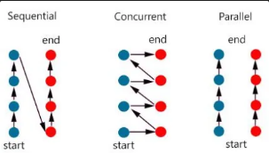
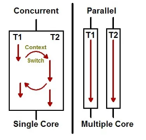
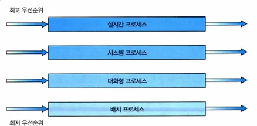
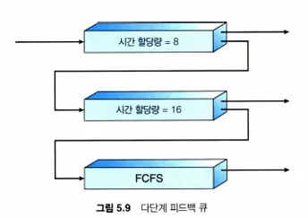
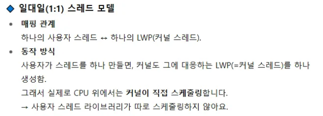
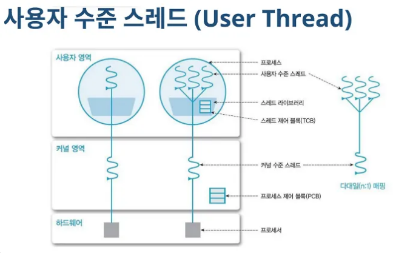
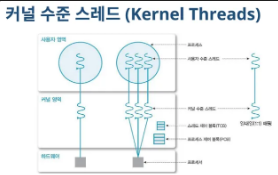

## CONTENT

---

### **6. 컨텍스트 스위칭 시에는 어떤 일들이 일어나나요? `종환`**

- 답변
  기존 프로세스 또는 쓰레드의 실행을 멈추고 다른 프로세스(또는 쓰레드)를 실행하게 됩니다. 이 때 PC, 레지스터, 프로세스 상태 등 실행 정보를 저장하고 커널이 다음 PCB를 참조하여 다음 프로세스를 실행할 준비를 합니다.
- 프로세스와 스레드는 컨텍스트 스위칭이 발생했을 때 어떤 차이가 있을까요?
  같은 프로세스의 스레드끼리의 컨텍스트 스위칭은 스택 영역 외에 힙 영역, Code, Data 영역이 공유되기 때문에 저장 또는 복원해야하는 정보의 수준이 다릅니다. 프로세스 컨텍스트 스위칭은 페이지 테이블을 교체하여 주소 공간을 통째로 바꿔야하기 때문에 캐시/TLB 무효화가 발생하게 됩니다. 이는 캐시 미스 오버헤드를 크게 발생시킵니다. 반면에 쓰레드는 레지스터와 스택 포인터만 교체해주면 되기 때문에 훨씬 가볍습니다.
- 컨텍스트 스위칭이 발생할 때, 기존의 프로세스 정보는 커널스택에 어떠한 형식으로 저장되나요?
  CPU 상태가 각 프로세스 고유의 커널 스택에 저장되고, PCB의 커널 스택의 포인터를 갱신합니다.
  다시 프로세스를 실행할 때는 PCB의 커널 스택 포인터를 다시 읽어서 프로세스를 재개합니다.
  - CPU 상태: CPU 레지스터(PC, 플래그 포함)
  - 커널 스택은 user stack과 별도로 커널 모드에 진입될 때 사용되는 각 프로세스 고유의 안전한 스택입니다.
- 컨텍스트 스위칭은 언제 일어날까요?
  - 프로세스가 I/O 요청 등으로 인해 Block되는 경우
  - 프로세스가 종료되는 경우
  - CPU 스케줄러에가 CPU를 다른 프로세스에 할당할 때 (선점형 환경)

**_질문_**

- 커널스택에 저장된다는 것은 PCB 포인터에 저장되는 것인가요? (정리 완료)

  - 컨텍스트 스위칭이 일어날때 CPU 레지스터 정보는 로컬 변수처럼 프로세스마다의 커널 스택 그 자체에 PUSH되어 저장됩니다. 따라서 PCB에는 CPU 레지스터가 직접적으로 저장되는 것이 아닌 **커널 스택의 스택 포인터**만을 갖고있습니다.
  - 컨텍스트 스위칭 과정
    1. ‘PC’를 포함한 레지스터 정보가 커널 스택에 PUSH되어 저장
    2. 다음 프로세스의 PCB에 접근하여 커널 스택의 SP를 CPU의 스택 레지스터(SR)에 로드
    3. 스택을 POP하면서 레지스터 복원
    4. 마지막 레지스터인 PC가 복원되면서 자연스럽게 프로세스 재개
  - 참고로 대부분의 기술 블로그나 교재에서는 PCB에 PC나 다른 레지스터 값이 곧바로 저장되는 것처럼 표현되어 있습니다만 이는 운영체제의 개념적 이해를 돕기 위한 추상적 표현입니다.
  - 실제 구현은 아래 그림과 같이 thread_struct라는 구조체에 스택 포인터(sp)의 스택에 레지스터값이 저장됩니다.
  - 그러나 그렇다고해서 PCB에 PC나 레지스터 값이 저장되었다고 표현해도 개념적으로 아주 틀린 말이라고 보기는 어렵습니다. 왜냐하면 결국에 PCB가 커널 스택의 유일한 경로이고 이는 참조(포인터)로 구현된 이진트리에서 자식 노드가 이진트리에 저장되어있다는 것과 비슷한 논리로 볼 수 있습니다.

    - thread_struct 구조

      ```c
      // arch/x86/include/asm/processor.h 파일에 정의되어 있습니다.

      struct thread_struct {
          /*
           * 컨텍스트 스위칭 시 저장되고 복원되는
           * 커널 스택 포인터(Kernel Stack Pointer)입니다.
           * x86_64에서는 RSP 레지스터 값이 여기에 저장됩니다.
           */
          unsigned long sp;

          // FS, GS 세그먼트 레지스터 값. Thread Local Storage 등에서 사용됩니다.
          unsigned long fsbase;
          unsigned long gsbase;

          // FPU(부동소수점 장치), SSE/AVX(벡터 연산) 등
          // 특수 레지스터의 상태를 저장하기 위한 공간
          struct fpu fpu;

          // 기타 아키텍처 종속적인 여러 필드들...
      }
      ```

    - 컨텍스트 스위칭 어셈블리어 의사 코드

      ```nasm
      ; --- Context Switch from A to B ---

      ; 1. Process A의 레지스터들을 커널 스택에 PUSH
      PUSH EAX  ; EAX 레지스터 값을 스택에 저장
      PUSH EBX  ; EBX 레지스터 값을 스택에 저장
      PUSH ECX  ; ... 이런 식으로 모든 범용 레지스터를 저장
      ...

      ; 2. 모든 정보를 저장한 후의 최종 SP 값을 Process A의 PCB에 저장
      MOV [Process_A_PCB_SP_Location], ESP

      ; 3. Process B의 PCB에 저장되어 있던 SP 값을 CPU의 ESP 레지스터로 로드
      MOV ESP, [Process_B_PCB_SP_Location]  ; << 바로 이 부분이 "SP 로드"입니다.

      ; 4. 이제 ESP는 Process B의 정보가 담긴 스택을 가리킴.
      ;    저장했던 역순으로 POP 하면서 레지스터들을 갱신.
      ...
      POP ECX  ; 스택의 값을 ECX 레지스터로 복원
      POP EBX  ; 다음 값을 EBX 레지스터로 복원
      POP EAX  ; 다음 값을 EAX 레지스터로 복원

      ; 5. 모든 레지스터 복원 후, IRET으로 최종 복귀 및 모드 전환
      IRET     ; PC, CS, Flags 레지스터를 복원하며 프로세스 B 실행 재개
      ```

**_피드백_**

`성헌`: pc, 스택포인터 등 어떤식으로 저장되는지 추가적으로 보완해주시면 좋을 것 같습니다 ! 모드 스위칭에 대한 추가 개념은 정말 좋았습니다.

`민재`: 추가적으로 정보를 가져오고 이 부분에 대해 더 정리하고 알아보면 좋을 거 같다고 짚어 주셔서 좋았습니다. 몇 가지 질문의 답변은 구어체가 아니라서 구어체로 정리해 놓으면 더 좋으실 거 같아요~

`정교`: 추가적으로 고민한 부분들에 대해서 정리해오셔서 같이 고민해보기 좋았던 것 같아요! 공통적으로 궁금했던 부분들이 있었어요. 다만 개념 설명 부분에서 말로만 풀어 설명하다보니, 이해가 되지 않았던 부분들도 있었는데, 보충자료가 있다면 함께 첨부해주시면 이해에 도움이 될 것 같아요!! 질문에 대한 답변을 명확하게 해주셔서 열심히 준비해오셨구나라고 느꼈습니다 🙂

`효성`: TLB라는 걸 잘 몰랐는데 추가 설명 감사합니다. 면접땐 인터럽트와의 차이도 더 설명해서 하면 좋을거 같아요!

---

### **7. 프로세스 스케줄링 알고리즘에는 어떤 것들이 있나요?** `정교`**,** `효성`

- 정교

  # 프로세스 스케줄링 알고리즘에는 어떤 것들이 있나요?

    <aside>
    
    *용어 정리*
    
    ---
    
    **Turn around time** : 작업에 필요한 총 시간
    
    **Starvation** : 특정 프로세스가 우선순위가 낮아 원하는 자원을 계속 할당받지 못하는 상태
    
    **Convoy Effect** : 시간이 많이 필요한 작업이 먼저 수행되어, 수행시간이 짧지만 나중에 도착한 작업이 수행되지 못하는 것 
    
    **Burst Time** : “**남은”** 실행 시간
    
    **Aging 기법** : 프로세스의 대기 시간이 길수록 우선순위를 높여주는 방식
    
    </aside>
    
    *답변 (비선점형 / 선점형)*
    
    | 종류 | 핵심 | 장점 | 단점 |
    | --- | --- | --- | --- |
    | FCFS(First Come First Served) | Ready Queue에 도착한 순서대로 CPU를 할당 | *Starvation 발생 X | - 평균 대기 시간이 길어진다 / 응답 시간이 길어진다 / *Convoy effect |
    | HRRN(Highest Response Ratio Next) | 프로세스가 끝나면 Ratio를 계산해 **큰 Ratio** 순으로 실행 / **Ratio** : (Turn around time + Burst Time) / Burst Time | *Starvation 발생 X / Aging 기법을 사용 | - burst time을 정확하게 예측하는 것은 불가능 / 예측하는 과정에서도 추가 오버헤드 발생 |
    | - | - | - | - |
    | RR(Round Robin) | 각 프로세스에 동일한 CPU 할당시간(time quantum) 부여 | 응답시간 빠름 | -  time quantum이 너무 짧으면 Context Switching이 자주 발생 → 오버헤드 증가 / time quantum이 너무 길면 FCFS 와 똑같다 | MFQ(Multilevel Feedback Queue) | 실행시간을 예측하지 않고, 실행시간이 짧은 것이 우선 | 응답시간이 빠름 / burst time 예측 필요 X | - 여전히 우선순위가 낮은 큐의 경우, starvation이 발생가능하다. |
    | - | - | - | - |
    | SJF(Shortest Job First) | 도착한 프로세스 중 burst time이 짧은 프로세스 먼저 할당 | 사실상 Optimal | - burst time을 정확하게 예측하는 것은 불가능 / 예측하는 과정에서도 추가 오버헤드 발생 / *Starvation 현상 발생 가능 |
    | SPN(Shortest Process Next) | SJF의 비선점형 방식 |  |  |
    | SRTF(Shortest Remaining Time First, SRT) | SJF의 선점형 방식 |  |  |


- RR을 사용할 때, Time Slice에 따른 trade-off를 설명해 주세요.

  - 정교
      <aside>
      
      - time quantum이 짧으면 응답시간을 단축시킬 수 있지만 Context Switching이 자주 발생하여 오버헤드가 증가하고, 전체 성능이 저하될 수 있다.
      - time quantum이 길면 오버헤드를 감소시켜 시스템 처리 효율이 올라갈 수 있으나, 응답 시간이 길어지고, 평균 대기 시간이 길어지며, Convoy effect가 발생가능하다.
      </aside>

  - 효성
    RR의 Ready Queue는 Circular Queue로 동작. CPU스케줄러는 한 프로세스에 시간할당량만큼 CPU할당. ⇒ 또한 CPU 스케줄러는 준비 큐에서 첫 번째 프로세스를 선택해 한 번의 시간 할당량 이후에 인터럽트를 걸도록 타이머를 설정한 후, 프로세스를 디스패치(발송) 한다.
    1. 타임슬라이스보다 버스트 시간이 짧을경우: 프로세스 자신이 CPU를 자발적으로 방출
    2. 긴 경우에는 OS에 인터럽트 발생. Context switching이 일어나고 실행하던 프로세스는 Ready Queue의 Rear에 넣어짐. 그 후 CPU 스케줄러는 준비 큐의 다음 프로세스 선택.

- 싱글 스레드 CPU 에서 상시로 돌아가야 하는 프로세스가 있다면, 어떤 스케쥴링 알고리즘을 사용하는 것이 좋을까요? 또 왜 그럴까요?

  - 정교
      <aside>
      
      - MLFQ 방식을 사용하는 것이 좋다.
      - 상시로 돌아가는 프로세스는 CPU-bound(CPU를 많이 사용하는 프로세스) 작업일 확률이 높다.
      - MLFQ는 프로세스가 Time Slice을 모두 소진하면 CPU 사용량이 많다고 판단한다.
      - CPU-bound로 판단된 프로세스는 더 낮은 우선순위의 큐로 이동한다.
      - 낮은 우선순위의 큐는 더 긴 타임 슬라이스가 할당되어 있다. 그러므로 해당 프로세스는 Context Switching이 자주 일어나지 않고, 
      오랫동안 CPU를 점유하며 연속적으로 작업을 수행할 수 있어 오버헤드가 줄어들고 효율성이 높아진다.
      - MLFQ는 프로세스의 동작에 따라 CPU-bound 작업에 긴 시간을 할당해주므로, 상시 실행되어야 하는 프로세스에 좋다.
      </aside>
      
      https://engineerinsight.tistory.com/285
      
      https://goodbyeanma.tistory.com/209

  - 효성
    GPT: RR방식. 상시로 돌아간다⇒ CPU를 주기적으로 할당 받아야 한다로 이해
    RR방식이 타임 슬라이스 단위로 돌아가기 때문에 항상 CPU를 주기적으로 확보 가능
    상시로 돌아간다⇒ 실시간 시스템을 의미하는 거라면?
    실시간 시스템은 **마감시간(Deadline) 보장이 핵심** → 따라서 **우선순위 기반, 선점형 스케줄링**이 필요. 대표 실시간 알고리즘은 **RMS(정적)**, **EDF(동적)**, **Proportional Share(비율)**, **POSIX 실시간**
    ### 1. **Rate-Monotonic Scheduling (RMS, 정적 우선순위)**
    - **원리**: 주기가 짧을수록(자주 실행될수록) 높은 우선순위 부여.
    - **특징**: 정적(Static) 우선순위, 선점형.
    - **장점**: 구현 단순, 경성 실시간에서 널리 사용.
    - **단점**: CPU 활용률이 100%까지 못 감. (최대 69% 정도까지만 안정적으로 보장)
    ***
    ### 2. **Earliest-Deadline-First Scheduling (EDF, 동적 우선순위)**
    - **원리**: 마감시한이 빠를수록 높은 우선순위.
    - **특징**: 동적(Dynamic) 우선순위.
    - **장점**: 이론적으로 CPU 활용률 100%까지 보장 가능.
    - **단점**: 우선순위를 계속 갱신해야 하므로 구현 복잡, 문맥 교환 많음.
    ***
    ### 3. **Proportional Share Scheduling (비율 기반)**
    - **원리**: CPU 시간을 일정 비율로 분배 (예: A=50%, B=30%, C=20%).
    - **장점**: 공정한 분배 가능.
    - **단점**: 절대적인 deadline 보장에는 취약.
    ***
    ### 4. **POSIX Real-Time Scheduling**
    - **SCHED_FIFO**: 같은 우선순위에서는 FIFO, 태스크가 끝나거나 블록될 때까지 실행.
    - **SCHED_RR**: 라운드 로빈 방식, 같은 우선순위끼리는 시간 할당량으로 교체.
    - **SCHED_OTHER**: 일반(non-real-time) 태스크용, 구현은 OS마다 다름.

- 동시성과 병렬성의 차이에 대해 설명해 주세요.

  - 정교
      <aside>
      
      - 병렬성은 **실제로 동시에 여러 작업이 처리**되지만, 동시성은 **동시에 실행되는 것 같이** 보이게 한다.
      - 멀티 코어에서 멀티 쓰레드를 동작시키는 병렬성과 달리, 동시성은 싱글코어에서 멀티 쓰레드를 동작시키는 방식이다.
      - 동시성은 “논리적인 개념”이고, 병렬성은 “물리적인 개념”이다.
      </aside>
      
      
      
      
      
      https://seamless.tistory.com/42

  - 효성
    https://seamless.tistory.com/42

- 타 스케쥴러와 비교하여, Multi-level Feedback Queue는 어떤 문제점들을 해결한다고 볼 수 있을까요?

  - 정교
      <aside>
      
      앞서 설명한 SPN, SRTF, HRRN 같은 알고리즘은 BT를 예측해야 했지만, 정확하게 예측하는 것은 불가능했다. 
      그리고, MLQ는 최초에 배정된 queue를 벗어나지 못해 시스템 변화에 적용하기 힘들다는 한계점이 존재했다.
      
      **MFQ**는 프로세스의 Queue 간 이동이 허용된 MLQ로 이러한 문제들을 해결하고, 
      프로세스에 대한 사전 정보 없이(**BT를 예상하지 않고**) SPN, SRTN, HRRN 기법의 효과를 기대할 수 있다는 장점이 있다.
      
      </aside>

  - 효성
    단일 큐 스케줄링은 우선순위가 가장 높은 프로세스를 결정하기 위해 O(n) 검색이 필요할수 있음⇒우선순위마다 별도의 큐를 유지함으로써 검색 시간 줄임
    특징: 각 큐마다 자체 스케줄링 알고리즘이 있을 수 있다. ex) 백그라운드(배치) 큐는 FCFS, 포그라운드 큐(대화형)는 RR.
    
    높은 우선순위 큐는 하위 큐보다 절대적인 우선순위 를 가짐. 예를 들어 대화형 프로세스 큐가 안비면 배치 프로세스는 실행 X.
    또한 배치 프로세스가 실행되고 있는데 대화형 프로세스가 큐에 들어가면 배치 프로세스는 선점됨(방빼!).
    혹은 CPU시간을 각 큐마다 일정량 배정 받아 동작 가능. 대화형 큐는 CPU시간의 80% 배정받고, 배치 큐는 20%배정 받아 스케줄링 가능.
    PS: **다단계 피드백 큐 스케줄링 알고리즘(MFQ)**에서는 프로세스가 큐들 사이를 이동하는 것을 허용한다. 프로세스들을 CPU 버스트 성격에 따라서 구분하고, 어떤 프로세스가 CPU 시간을 너무 많이 사용하면, 낮은 우선순위의 큐로 이동된다. 또한 기아를 방지하기 위해 우선순위가 낮은 큐에서 너무 오래 대기하는 프로세스가 점차 우선순위가 높은 프로세스로 이동될 수 있다.
    예시:
    
    일단 전제 조건은 MLQ와 같음( 0,1,2 가 있으면 일단, 낮은 우선순위 큐가 실행되려면 상위 큐가 비어있어야함. 또한 하위 큐 프로세스 동작하고 있는 데 상위 큐에 프로세스가 도착하면 선점됨. )
    그림 설명: 시간 할당량 8안에 안끝나면, 하위 큐인 16할당량 큐 꼬리로 이동하고, 또 안끝나면 그 하위인 FCFS로 이동. 너무 오래 대기 하는 건 aging을 통해 상위로 이동가능. 이 스케줄링 알고리즘은 CPU 버스트가 8밀리초 이하인 모든 프로세스에 최고의 우선순위를 부여.

- FIFO 스케쥴러는 정말 쓸모가 없는 친구일까요? 어떤 시나리오에 사용하면 좋을까요?

  - 정교
      <aside>
      
      FIFO 스케줄러의 장점은 구현이 간단하고 단순하다는 점.
      문서가 입력된 순서대로 인쇄되어야하는 프린터 대기열이나, 
      네트워크 통신 패킷을 송신 순서대로 처리해야 할 경우, 
      유통기한이 있는 부패하기 쉬운 상품을 먼저 출고해야하는 출고관리 시 사용할 수 있다.
      
      </aside>

  - 효성
    ### 1. **배치 처리 시스템 (Batch Processing Systems)**
    - 예: 하루에 한 번씩 대량 데이터 처리, 급하지 않은 작업
    - FCFS는 구현이 간단하고, 공정함(먼저 온 순서대로 처리)을 제공하기 때문에 유용
    - 프로세스 간 우선순위가 특별히 중요하지 않을 때 사용
    ### 2. **입출력(I/O) 요청 스케줄링에서**
    - 디스크 I/O 스케줄링에서 기본 정책으로 사용되기도 해
    - 가장 간단하고 예측 가능한 방식이므로, 특정한 경우에 유용
    ### 3. **실험 및 학습용 시뮬레이션**
    - 스케줄링 알고리즘의 비교 실험 시, 기준점으로 사용됨
    - 성능 분석, 평균 대기 시간 계산 등에 baseline 역할
    ### 4. **정적 작업 처리 시스템**
    - 작업이 미리 정해져 있고, 대략적인 도착 시간과 실행 시간이 예측 가능하다면
    - 예: 단순한 임베디드 시스템, 프린터 큐

- 우리는 스케줄링 알고리즘을 "프로세스" 스케줄링 알고리즘이라고 부릅니다. 스레드는 다른 방식으로 스케줄링을 하나요?

  - 정교
      <aside>
      
      일반적으로 프로세스 스케줄링 알고리즘은 커널 수준 스레드 스케줄링 이라고 부르고, 스레드는 사용자 수준 스레드 스케줄링이라고 부른다.
      커널 수준 스레드 스케줄링의 경우, 운영체제가(커널)이 커널스레드를 직접 관리하지만, 
      사용자 수준 스레드 스케줄링의 경우 운영체제는 스레드의 존재를 모르고 프로세스만 스케줄링하게 되며, 스레드 라이브러리라는 작은 스케줄러가 내부 유저 스레드간 전환을 담당하게 된다.
      
      </aside>

  - 효성
    알고리즘 자체는 크게 다르지 않음. 다만 스레드는 USER와 커널 스레드 스케줄링이 따로 있음.
    공룡책 왈: 최신 운영체제에서는 스케줄링 대상이 프로세스가 아니라 커널 수준 스레드임. (PS: 유저 스레드는 스레드 라이브러리에 의해 관리됨)
    다대일과 다대다모델을 구현하는 시스템에서는 스레드 라이브러리는 사용자 수준 스레드를 가용한 LWP상에서 스케줄 한다.(**LWP (Light Weight Process, 경량 프로세스)**: 커널이 관리하는 실행 단위) ⇒**다대일/다대다 모델에서는 커널이 직접 스레드들을 다루지 않고, 스레드 라이브러리가 사용자 스레드를 LWP 위에서 배치하고 실행 순서를 정해 준다**는 뜻
    일대일은?? GPT답
    

- 유저 스레드와 커널 스레드의 스케쥴링 알고리즘은 똑같을까요?

  - 정교
      <aside>
      
      다르다. 
      
      유저 스레드는 스레드 라이브러리에서 관리되면서 User-Level 스케쥴링을 사용하고, 커널 스레드는 운영체제가 직접 관리하므로 Kernel-Level 스케줄링을 사용한다.
      
      **유저 스레드**
      장점 : 
      
      1. 스레드 라이브러리로 인해 스케줄링과 동기화를 위해 System Call을 발생시키지 않기 때문에 오버헤드가 적다.
      2. 커널이 스레드의 존재를 모르기 때문에 유저모드와 커널 모드 간 전환이 없다.
      
      단점 :  
      
      3. 커널은 개별적인 유저 스레드를 각각 인식하지 못하기 때문에, 유저스레드 중 하나가 간단한 작업이라도 요청하게 되면, 해당 프로세스 내의 모든 스레드가 중단된다. (Blocking System Call)
      4. 같은 의미로 커널 입장에서는 단 하나의 프로세스로 인식하기 때문에, 동시에 여러 코어에서 유저 스레드를 실행할 수 없다.
      
      **커널 스레드**
      장점 : 
      
      5. 각 스레드가 어떤 일을 하고 있는지 파악할 수 있고, 개별적으로 관리가 가능하다.
      6. 동작중인 스레드가 System Call해도 해당 프로세스 내 다른 스레드는 개별적으로 실행될 수 있다.
      
      단점 :
      
      7. 모든 것을 커널이 관여하기 때문에 비용이 비싸고 유저모드 <> 커널모드간 전환이 빈번하기 때문에 성능상 비효율적이다.
      
      </aside>
      
      
      
      
      
      https://blogimadetosee.tistory.com/85
      
      https://kspsd.tistory.com/50

  - 효성
    - 다르다. User스레드 알고리즘. 즉, 스레드 라이브러리가 사용자 수준 스레드를 가용한 LWP상에서 스케줄 하는 것은, 프로세스 경쟁범위라는 PCS를 사용. 하지만 이 스케줄링을 한다고 해서 실재로 cpu상에서 실행된다는 건 아님. 그래서 LWP의 커널 스레드를 물리적인 CPU코어로 스케줄하는 것을 필요로 한다. 어느 커널 스레드를 스케줄 할지 결정하는 것이 시스템 경쟁(SCS)임. SCS스케줄링에서의 cpu경쟁은 모든 스레드 사이에서 일어남. 일대일 모델은 오직 SCS만을 사용. 왜? 유저 스레드-커널 스레드 1대1 mapping이니까 user스레드 스케줄링인 pcs는 필요없음.

기타 학습 레퍼런스

https://kfdd6630.tistory.com/entry/Starvation ⇒ Starvation 과 Deadlock 비교

https://inpa.tistory.com/entry/%F0%9F%91%A9%E2%80%8D%F0%9F%92%BB-%ED%94%84%EB%A1%9C%EC%84%B8%EC%8A%A4-%E2%9A%94%EF%B8%8F-%EC%93%B0%EB%A0%88%EB%93%9C-%EC%B0%A8%EC%9D%B4 ⇒ 프로세스, 스레드 관련 개념

**_질문_**

- MLQ나 MFQ도 time slice 방식인가요?
  - 네
- MFQ의 대기큐를 병렬적이라고 생각해도 되나요? →놉
- 저는 I/O 버스트는 응답시간이 중요하고 CPU 버스트는 어차피 오래걸리기 때문에 응답시간이 덜 중요하다고 봤는데 어떻게 생각하시나요? MLQ에도 이러한 원리가 적용된게 아닌가 생각이 듭니다.

메모

- lwp 어려워요 ㅠㅠ
- 커널 쓰레드는 실제로 어떻게 존재할까? LWP를 커널 쓰레드라고 봐도 될까?
  - 커널 쓰레드는 커널 스케줄러가 CPU를 할당하는 최소 실행 단위
  - LWP는 유저 쓰레드가 커널 쓰레드와 연결되도록 하는 핸들
  - 1:1 모델에서는 LWP와 커널 스레드는 사실상 동일

**_피드백_**

`성헌`:

- (정교발표)표 형식으로 쉽게 내용을 파악할 수 있었습니다. 듣다보니 커널스레드와 유저스레드를 병렬성과 동시성의 관점에서 이해할 수 있었습니다.
- (효성발표) MLFQ 에 딥한 내용 때문에 해당 개념을 좀 더 이해할 수 있었습니다.

`정교`

- 같은 주제로 자료를 준비했지만, 저와 다른 관점으로 꼼꼼하게 내용을 준비해주신것 같아요! 내용을 전달해주시는 방식도 이해가 잘되고 좋았습니다! 간혹 부분부분 파트에서 레퍼런스를 보충하면 좋겠다라는 생각이 들었는데요! 그 부분만 보충이되면 너무 풍부한 발표가 될 것 같습니다 ㅎㅎ 잘들었습니다 😊

`민재`

- 정교: 개념부터 정리를 해주셔서 이해하는 게 수월했습니다. 스터디 시간이라 자세히 풀어서 설명해주신 게 좋았지만, 면접에서는 핵심만 간결하게 하는 게 더 좋을 거 같습니다~~(알아서 잘 하실 거 같긴 하지만…)~~
- 효성: 내용을 설명해주시고 전달해주시는 방식이 이해가 잘 되었습니다. 실전에서는 말만 잘 정리해서 하시면 더 좋을 거 같아요!

`효성`: 개념설명부터 깔끔한 표로 정리해 주셔서 좋은거 같습니다! 커널 스레드랑 유저스레트의 차이도 그림으로 깔끔한 설명 감사합니다. cpu 할당이 상시 필요한 경우 MFQ 방식이 좋다고 하신부분도 저랑 달라서 새롭게 배우고 갑니다!

`종환`:

- (정교님) 너무 깔끔하게 정리돼서 이해가 잘됐습니다! 중간에 MFQ 방식이 설명이 부족해서 이해가 덜됐었는데 이후에 잘 설명해주셔가지고 잘 이해됐습니다.
- (효성님) 깊이있는 내용까지 다뤄주셔서 새로운걸 많이 알게 된 것 같습니다.

---

### **8. 뮤텍스와 세마포어의 차이점은 무엇인가요? `성헌`**

뮤텍스는 하나의 소유권을 가진 스레드만이 특정 자원을 lock/unlock 할 수 있는 기법입니다. 단일 자원을 보호해야 하는 경우 주로 사용됩니다.

세마포어는 정수 값을 가지는 동기화 기법으로, 특정 자원에 접근할 수 있는 스레드의 수를 제어합니다. 정수 값이 1 이상일 때는 스레드가 접근 가능한 상태이고, 0일 때는 접근이 불가능한 상태입니다.

또한 정수 값을 0,1로 제한하면 이진 세마포어로서 뮤텍스와 유사하게 동작하고 1 이상으로 제한하면 카운팅 세마포어로서 구현됩니다.

- 이진 세마포어와 뮤텍스의 차이에 대해 설명해 주세요.

  이진 세마포어는 0 또는 1 두가지 상태를 가지고 , 뮤텍스는 lock(소유), unlcok(미소유) 상태를 가집니다. 따라서 이진 세마포어와 뮤텍스 락은 유사하게 동작하지만 상호 배제의 관점에서 차이점을 가집니다.

  이진 세마포어는 주로 신호 전달 메커니즘으로 스레드 동기화나 자원 접근 제한을 위해 사용되고, 소유권 개념이 없어서 상태를 해제하는 쓰레드가 다를 수도 있습니다. 뮤텍스는 소유권이 있어서 공유 자원의 접근을 상호 배제적으로 관리하기 위해 사용됩니다.

  [Difference between Binary Semaphore and Mutex - GeeksforGeeks](https://www.geeksforgeeks.org/operating-systems/difference-between-binary-semaphore-and-mutex/)

- Lock을 얻기 위해 대기하는 프로세스들은 Spin Lock 기법을 사용할 수 있습니다. 이 방법의 장단점은 무엇인가요? 단점을 해결할 방법은 없을까요?

  스핀락이란 프로세스 또는 스레드가 락을 얻을 때 까지 반복적인 루프를 회전(spin)하묘 확인하는 동기화 기법입니다. 락을 기다리는 스레드는 스레드를 대기 상태로 옮기는 문맥 교환, 락이 사용 가능할 때 대기 중인 스레드를 복원하기 위한 문맥교환까지 2번의 문맥 교환을 하는 시간이 필요한데, 락이 유지되는 기간이 이보다 짧을 시 스핀락을 사용합니다.

  스핀락의 장점은 스레드를 블록하지 않기 때문에 문맥 교환이 필요하지 않습니다. 단점으로는 락이 유지되는 기간이 긴 경우 계속해서 락을 얻기 위해 루프를 돌게 되는데 cpu 자원을 낭비하게 됩니다.

  이러한 문제를 해결하기 위해서 하이브리드 접근 방식을 주로 사용합니다. 일정 시간 스핀 락을 사용하다가 락을 획득하지 못하면 블로킹 메커니즘으로 전환합니다. 락이 유지되는 기간이 짧을 시에만 busy-wating하고, 락이 유지되는 기간이 길어질 시에는 cpu를 양보하고 대기 상태로 들어갑니다. (컨텍스트스위칭 비용과 CPU 작업 낭비를 생각해보자)

  추가적으로 멀티코어 환경에서 하나의 코어에서 임계구역을 처리하는 동안 다른 코어는 스핀하고 있을 수 있습니다. 따라서 스핀락은 싱글 코어에서는 의미가 없고 다중 코어 시스템이 발전할 수록 이점이 커진다고 생각할 수 있습니다.

- 뮤텍스와 세마포어 모두 커널이 관리하기 때문에, Lock을 얻고 방출하는 과정에서 시스템 콜을 호출해야 합니다. 이 방법의 장단점이 있을까요? 단점을 해결할 수 있는 방법은 없을까요?
  커널로 관리하는 상황에서 장단점을 고려할 때는 CPU 사용량과 문맥 전환 오버헤드가 트레이프 오프 관계인 것을 생각해야 합니다.
  락을 얻고 방출하는 과정에서 시스템 콜을 호출한다는 것은 즉, 락을 얻으려는 스레드가 CPU 점유를 양보하고 대기 큐로 진입하기 떄문에 이 과정에서 다른 스레드가 CPU를 사용할 수 있어서 시스템 효율성이 올라갑니다.
  반대로 단점으로는 스레드를 대기 큐로 진입시킬 때와 다시 깨우는 과정까지 총 두번의 커널 개입이 필요합니다. 즉, 두번의 컨텍스트 스위칭 비용이 발생하는데 이 비용보다 락을 점유하는 시간이 짧다면 이 방법은 매우 비효율적일 것입니다.
  따라서 이러한 점을 해결하기 위해서는 스핀락에서 설명했던 하이브리드 기법을 사용하거나 CAS(Compare-And-Swap)같은 lock-free 기법을 사용하여 시스템 콜을 사용하지 않습니다. 마지막으로 리눅스 커널에서 사용되는 읽는 작업에는 락을 걸지 않고 쓰는 작업에만 락을 거는 RCU 기법이 있습니다.
  [Lock-Free 알고리즘과 CAS 연산](https://onseok.blog/lock-free/)
  [[Linux Kernel] RCU (Read-Copy-Update)](https://hyeyoo.com/135)

[추가적인 내용](https://www.notion.so/25ab7864ae20804cb88de87e060ae685?pvs=21)

---

**_질문_**

- 이진 세마포어에 락을 다른 스레드가 접근? 풀어줄 수 있다고 했는데 이게 어떻게 가능한지? → release 함수에 대해 좀 더 조사해볼 것.
- 스핀락에서 문맥 교환이라고 언급하셨는데 mode switching이 아니라 항상 context switching이 맞나요?
  - mode switching보다는 불필요한 context switching을 막는데 이점이 있다!
- 스핀락의 경우 스레드의 상태변화는 일어나지 않나요?
- 뮤텍스 세마포어 말고 다른 방법은 없나욥? 감사합니다

**_피드백_**

`종환`: 이진 세마포어에 대한 설명은 좋았는데 예시가 있었으면 더 좋았을 것 같아요! 잘들었습니다!

`민재`: 꽤 깊이 있게 준비하신 거 같아서 좋았습니다.

`정교`: 발표 잘들었습니다!! 넓게 고민해보려는 노력이 잘 보였던 것 같아요!!! 다만 의견을 전달해주실때 레퍼런스가 조금 더 명확하면 좋을 것 같습니다!! 내용을 전달해주시는 부분에서 이해가 잘되었어요 😊

`효성`: 많은 고민하신게 느껴지는 발표였습니다. 잘들었습니다!

### **9. Deadlock 에 대해 설명해 주세요. `민재`, `건희`**

민재: 데드락은 교착상태로, 둘 이상의 프로세스 또는 스레드들이 자원에 대한 요구가 엉켜 서로 영원히 대기하는 상황을 말합니다. 이는 주로 한정된 자원을 여러 프로세스가 동시에 사용하는 환경에서 서로 상대방이 사용 중인 자원을 쓰기 위해 대기하는 상황에서 발생합니다.

- Deadlock 이 동작하기 위한 4가지 조건에 대해 설명해 주세요.

  [민재]
  4가지 조건에는 상호배제, 점유 상태로 대기, 선점 불가, 순환성 대기가 있습니다.
  상호배제는 자원에 대해 하나의 프로세스만이 사용할 수 있는 경우를 말합니다. 즉, 하나의 자원을 동시에 여러 프로세스가 사용할 수 없습니다. 이게 가능하다면 데드락은 발생하지 않습니다.
  점유 상태로 대기는 자원 하나를 붙잡고 있는 상태에서 다른 자원을 기다리는 경우를 말합니다. 즉, 2개 이상의 자원이 동시에 필요한 경우 순차적으로 할당 받으면서 일부 자원이 다른 프로세스가 붙잡고 놔주지 않아 무한대기에 빠질 수 있습니다. 예를 들어 카메라 앱에서 마이크와 카메라 2가지 자원을 사용하려고 합니다. 이때 카메라는 할당을 받았지만 마이크를 할당받지 못해서 기다리고 있는 상황을 말합니다.
  선점 불가는 다른 프로세스가 자원을 뺏을 수 없는 것을 말합니다. 우선순위 선점이 가능해진다면 다른 앱으로부터 마이크를 뺏어와 카메라 앱에서 먼저 사용할 수 있습니다. 이는 운영체제 수준에서 처리 가능합니다.
  순환성 대기는 모든 프로세스가 다른 프로세스가 사용 중인 자원을 기다리는 상황에서 마지막 프로세스가 첫 번째 프로세스가 사용 중인 자원을 쓰기 위해 대기 중인 상황입니다. 꼬리에 꼬리를 물어 사이클이 만들어 지게 됩니다.

- 그렇다면 3가지만 충족하면 왜 Deadlock 이 발생하지 않을까요?

  [민재]
  상호배제가 충족되지 않는다면, 하나의 자원에 동시에 접근이 가능하기 때문에 무한 대기 상황이 발생하지 않습니다.
  점유 상태로 대기가 충족되지 않는다면, 자원 하나를 붙잡고 있는 상태에서 다른 자원을 기다리지 않기 때문에 자원을 무한정 기다리지 않아도 됩니다.
  선점 불가가 충족되지 않는다면, 자원을 뺏어서 사용할 수 있기 때문에 무한 대기 상황이 발생하지 않습니다.
  순환성 대기가 충족되지 않는다면, 사이클이 발생하지 않기 때문에 하나의 프로세스가 자원을 사용하고 해제하면 줄줄이 자원을 사용할 수 있습니다.

- 어떤 방식으로 예방할 수 있을까요?

  [민재]
  교착 상태 조건 4가지 중 최소한 하나가 성립하지 않도록 하여 예방할 수 있습니다.
  상호배제가 충족되지 않는다면, 하나의 자원에 동시에 접근이 가능하기 때문에 무한 대기 상황이 발생하지 않습니다. 읽기-전용 파일은 여러 스레드가 동시에 접근하는 것을 허용합니다. 이에 대해 대기할 필요가 없습니다. 하지만 일반적으로 해당 조건을 거부하여 예방하는 것은 불가능합니다. 특정 자원들은 근본적으로 공유가 불가능하기 때문입니다.
  점유하며 대기는 자원을 요청할 때마다 다른 자원을 보유하지 않도록 해야 합니다. 그렇기 때문에 스레드가 자원을 전혀 갖고 있지 않을 때만 자원을 요청하도록 합니다. 스레드가 추가 자원을 요청하기 위해서는 자신에게 할당된 모든 자원을 먼저 해제해야 합니다.
  선점 불가(비선점)조건은 이미 할당된 자원이 선점되지 않아야 한다는 것입니다. 한 스레드가 자원을 요청할 때 이를 사용할 수 있는지를 검사합니다. 사용 가능하다면 할당하여 사용하지만, 사용이 불가능하다면 해당 자원이 대기하고 있는 다른 스레드에 할당되어 있는지를 검사합니다. 만약 그렇다면 대기 중인 스레드로부터 원하는 자원을 선점해서 이것들을 요청하는 스레드에게 할당합니다. 그렇지 않다면, 즉 자원을 이용할 수 없거나 다른 대기 스레드에 점유되어 있지 않으면 요청 스레드는 반드시 대기해야 합니다.
  위 3가지는 대부분 상황에서 실용적이지 않습니다.
  순환 대기 조건이 성립되지 않도록 하기 위한 방법 모든 자원 유형에 전체적인 순서를 부여하여 각 프로세스가 열거된 순서대로 오름차순으로 자원을 요청하도록 요구하는 것입니다.

- 왜 현대 OS는 Deadlock을 처리하지 않을까요?

  [민재]
  우선 데드락이 빈번히 일어나지 않습니다. 그에 비해 데드락을 방지하고자 적용하는 알고리즘으로 일어나는 성능 저하와 같은 비용이 더 큽니다. 심한 교착 상태가 발생하게 되면 사용자가 직접 프로세스를 종료시키는 방법을 권장합니다.

- Wait Free와 Lock Free를 비교해 주세요.
  [민재]
  Lock free 알고리즘은 락 없이도 최소한 하나의 스레드는 작업을 완료할 수 있다는 보장을 제공합니다. 이는 중간에 다른 스레드가 개입할 수 없는 연산인 원자적 연산을 활용해 자원에 대한 동시 접근을 제어합니다. 이는 교착 상태가 발생하지 않고 우선순위 역전이 없다는 장점이 있지만, 모든 스레드가 작업을 완료하는 데 걸리는 시간이 보장되지 않는다는 단점이 있습니다.
  Wait free 알고리즘은 모든 스레드가 유한한 시간 내에 작업을 완료할 수 있다는 보장을 제공합니다. 모든 스레드가 일정한 시간내에 작업을 완료할 수 있도록 설계되어 있고, 원자적 연산을 활용해 race condition 없이 자원을 안전하게 접근할 수 있습니다. 이는 무한 대기가 없고, 예측 가능성이 높다는 장점이 있습니다. 다만 구현이 복잡하고 성능 상의 오버헤드가 발생할 수 있습니다.

**_질문_**

- (성헌)4가지 조건 중에 특정 하나의 조건만 충족시키지 않게 한다면 어떤게 쉬울까요?
- (효성)

1. DeadLock과 이름이 비슷한 DB lock에 대해서도 궁금합니다.(저도 찾아보겠습니다ㅎㅎ)
2. 프로세스 DeadLock과 스레드 DeadLock에 차이가 있나요?

- (정교) 현대 OS는 deadlock을 처리하지 않는다고 말씀해주셨는데, 그럼 deadlock은 어떻게 감지할까요? 감지하기 위해서는 deadlock의 조건 중 어떤 조건을 우선적으로 확인할까요?
  - 탐지, 회피(은행원 알고리즘)
  - 순환형 대기를 우선적으로 확인
- (종환) wait free에서 원자적 연산에서 다른 스레드가 개입할 수 없다고 하셨는데 제가 찾아본 바로는 원자적 연산에서 기존 자원이 달라졌다면 다른 쓰레드가 이미 처리한 것으로 간주하고 retry하는 방식으로 알고 있었는데 제가 잘못 이해한걸까요??
- → (현우) : rollback이 아닌 retry입니다 → 감사합니다. →저도요

메모

- banker’s algorithm은 데드락 회피에 중요한 알고리즘이니 알아두자.
- 데드락 탐지에는 순환형 대기를 탐지한다! → 이것도 맞는 말이고 보통 대기 그래프를 통해 사이클을 탐지하는 방식으로 확인합니다!

**_피드백_**

`성헌`: 작성하신 내용과 예시까지 같이 언급해주셔서 이해가 금방 되었습니다.

`종환`: 발표도 정돈되게 해주셔서 듣기 좋았습니다! 상세한 예시도 있어서 좋았던 것 같아요.

`정교`: 설명잘들었습니다! 설명이 되게 자세해서 흐름을 따라가다보니 이해가 정말 잘되었어요!! 나중에 참고할만한 레퍼런스가 있다면 추가해주시면 더욱 학습하는데 도움이 될 것 같습니다 ㅎㅎ

`효성`: 깔끔한 설명이라 잘 들었습니다! 약간 그림도 첨부하면 좋을거 같은 생각입니다! 잘들었습니답!
