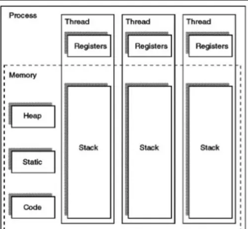
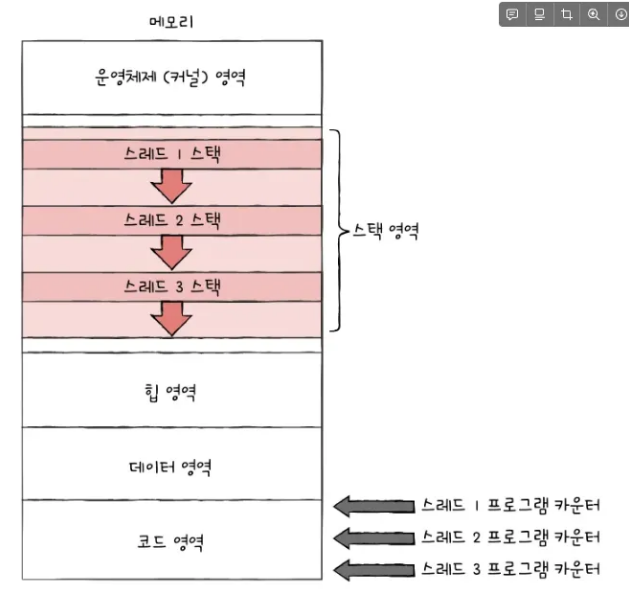

# **시스템 콜이 무엇인지 설명해 주세요. (민재)**

답변

커널에서 제공하는 기능을 사용하기 위한 인터페이스라고 할 수 있습니다. 응용 프로그램에서 커널의 기능을 사용해야 할 때가 있습니다. 하지만 직접 커널에 접근해서 기능을 사용할 수는 없고, 이를 라이브러리 함수의 형태로 접근해서 사용할 수 있게끔 합니다.

- 우리가 사용하는 시스템 콜의 예시를 들어주세요.
  exit는 프로세스를 종료하는 시스템 콜입니다. 모든 자원을 반납한 뒤 부모 프로세스에게 종료 상태를 나타내는 인자를 전달합니다.
  fork는 부모를 복제해 자식 프로세스를 생성하는 시스템 콜입니다. fork를 통해 자신의 복사본을 자식 프로세스로 생성합니다. 이때 자식 프로세스를 위한 메모리가 새롭게 할당됩니다.
- 시스템 콜이, 운영체제에서 어떤 과정으로 실행되는지 설명해 주세요.
  사용자 모드에서 시스템 콜을 호출합니다. 그러면 사용자 모드에서 커널 모드로 변경됩니다. 커널에 전달된 시스템 콜에 알맞은 번호의 루틴을 호출합니다. 커널에서는 각각의 시스템 콜을 구분하기 위해 기능 별로 고유 번호를 할당하고 있습니다. 이런 고유 번호에 맞는 제어 루틴을 커널 내부에 정의합니다. 이러한 제어루틴을 호출해 실행하게 됩니다. 이를 모두 처리하고 나면 커널 모드에서 다시 사용자 모드로 전환이 됩니다.
- 시스템 콜의 유형에 대해 설명해 주세요.
  프로세스를 제어하는 유형이 있습니다. 이는 프로세스 생성 및 종료, 메모리에 로드 및 실행 등의 업무를 처리하게 됩니다. 예시로는 fork, wait 함수 등이 있습니다.
  파일 관리 유형에서는 파일 생성 및 삭제, 열기, 닫기, 읽기, 쓰기 등의 업무를 처리합니다. open, read, write 등이 있습니다.
  이 외에도 디바이스 관리, 정보 유지, 통신, 보안 등의 유형이 존재합니다.
- 운영체제의 Dual Mode 에 대해 설명해 주세요.
  사용자 모드와 커널 모드로 나눠집니다. 사용자 모드에서는 응용 프로그램이 실행됩니다. 커널 모드에서는 운영체제 코드가 실행되며, 시스템 자원에 직접적인 접근이 가능합니다. 그렇기 때문에 응용 프로그램은 사용자 모드에서 실행되고 시스템 자원이 필요한 경우 시스템 콜을 통해 커널 모드로 전환되었다가 돌아오게 됩니다. 이는 CPU에서 모드 비트라는 플래그로 1은 사용자 모드, 0은 커널 모드로 지정해 구분합니다.
- 왜 유저모드와 커널모드를 구분해야 하나요?
  사용자 프로그램이 운영체제 메모리 영역을 건드리면 OS가 망가져 시스템 전체에 영향을 줄 수 있습니다. 그렇기 때문에 커널 모드에서만 시스템 메모리에 접근할 수 있게 제한을 두어 OS를 보호합니다. 또한 시스템 자원을 동시에 여러 프로그램에서 사용하려고 하면 충돌이 발생하게 됩니다. 이를 커널 모드에서 관리하도록 합니다.
- 서로 다른 시스템 콜을 어떻게 구분할 수 있을까요?
  커널 내부에는 고유 번호와 함께 서비스 루틴이 정의되어 있습니다. 각각의 시스템 호출에 대해 고유 번호를 부여하고 해당 번호에 알맞은 서비스 루틴을 정의해두어 구분하도록 설계되어 있습니다.

시스템콜과 인터럽트 중 어떤 개념이 더 넓은 범위일까요? → 이 개념도 명확하게 알고가면 좋을 것 같아요!

# **인터럽트가 무엇인지 설명해 주세요. (종환)**

답변

- 인터럽트는 어떻게 처리하나요?
  - 하드웨어에서 인터럽트 신호가 발생하면 인터럽트 컨트롤러가 이를 수신해 CPU에 신호를 보냅니다. CPU는 명령어가 끝날 때마다 인터럽트 신호를 확인하여 인터럽트 발생 시, 현재 프로그램 카운터와 레지스터 값을 스택에 저장하고, 신호에 맞는 ISR을 인터럽트 벡터 테이블에서 찾아 실행시킵니다. ISR이 종료되면 스택에 저장된 컨텍스트로 다시 스위칭되어 프로그램이 재개됩니다.
  - 추가적으로 소프트웨어 인터럽트가 발생하면 인터럽트 컨트롤러를 거치지 않고 즉시 ISR을 수행할 수 있습니다.
    
- Polling 방식에 대해 설명해 주세요.
  - Polling 방식은 주기적으로 특정 장치를 조회하여 특정 이벤트가 발생했는 지를 계속해서 확인하는 방식입니다. 이 방식은 CPU가 주기적으로 확인해야하므로 인터럽트보다 반응이 느리고 CPU 자원을 많이 소모할 수 있습니다. 그러나 외부 장치의 변화가 매우 빈번하게 일어나는 경우 오히려 Polling 방식이 더 효율적일 수 있습니다. 이러한 특징을 고려하여 polling과 인터럽트를 혼용하는 하이브리드 시스템도 존재합니다.
    
- HW / SW 인터럽트에 대해 설명해 주세요.
  - 하드웨어 인터럽트는 CPU 외부의 장치에서 발생하는 인터럽트이고, SW 인터럽트는 CPU 내부에서 프로그램에 의해 의도적으로 발생하는 인터럽트입니다. 시스템 콜, 프로그램 예외 발생 시, 소프트웨어 인터럽트가 발생하며 나머지 타이머, 네트워크 통신, 키보드, 마우스, 파일 입출력 완 등에서 발생하는 인터럽트가 하드웨어 인터럽트입니다. 
    
- 동시에 두 개 이상의 인터럽트가 발생하면, 어떻게 처리해야 하나요?
  - 인터럽트 컨트롤러에서는 하드웨어 인터럽트의 우선순위가 높은 인터럽트를 우선적으로 CPU에 전달하고, CPU에서는 소프트웨어 인터럽트를 포함하여 최종적으로 우선순위에 따라 인터럽트를 무시하거나 새 인터럽트를 중첩시켜 우선적으로 처리합니다. 하드웨어 인터럽트의 경우에 이미 우선순위가 높은 인터럽트가 수행중이라면 다른 CPU로 인터럽트를 분산시킬 수도 있지만 그러지 못할 때는 인터럽트 컨트롤러에서 대기 상태로 남아있게 됩니다.

# **프로세스가 무엇인가요?(효성, 건희)**

답변
- 실행 중인 프로그램 (Code + Data + Stack + Heap + Context)
- 즉, 단순 파일(프로그램)과 달리 실행 상태를 포함.

- 프로그램과 프로세스, 스레드의 차이에 대해 설명해 주세요.
  - **프로그램**: 디스크에 저장된 실행 파일.
  - **프로세스**: 실행 중인 프로그램 (독립된 주소 공간).
  - **스레드**: 프로세스 내 실행 단위 (주소공간 공유).
- PCB가 무엇인가요?
  - 프로세스 상태 정보를 담는 커널 자료구조.
  - 내용: PID, 레지스터 값, PC, 스케줄링 정보, 메모리 정보, 파일 핸들 등.
- 그렇다면, 스레드는 PCB를 갖고 있을까요?
  - 스레드는 PCB 전체를 공유하지 않음.
  - 프로세스의 PCB를 공유, 대신 스레드마다 **TCB(Thread Control Block)** 존재.
- 리눅스에서, 프로세스와 스레드는 각각 어떻게 생성될까요?
  - `fork()` → 새로운 프로세스 생성.
  - `clone()` → 스레드 생성 (주소 공간 공유).
- 자식 프로세스가 상태를 알리지 않고 죽거나, 부모 프로세스가 먼저 죽게 되면 어떻게 처리하나요?
  - 자식이 부모에게 상태를 알리지 않고 종료 → **좀비 프로세스** 발생.
  - 부모가 먼저 종료 → **고아 프로세스**, init(1번 프로세스)이 대신 부모 역할 수행.
- 리눅스에서, 데몬프로세스에 대해 설명해 주세요.
  - 사용자의 세션과 분리되어 **백그라운드에서 계속 동작**하는 프로세스.
  - 예: 웹서버(`httpd`), DB 서버(`mysqld`).
- 리눅스는 프로세스가 일종의 트리를 형성하고 있습니다. 이 트리의 루트 노드에 위치하는 프로세스에 대해 설명해 주세요.
  - **init 프로세스(PID=1)**
  - 모든 프로세스의 조상, 고아 프로세스를 회수.

# **프로세스 주소공간에 대해 설명해 주세요. (성헌)**

[답변 ](https://www.notion.so/25ab7864ae2080f99532d5d0df6ce9ff?pvs=21)

- 초기화 하지 않은 변수들은 어디에 저장될까요?
  - c언어
    - bss 세그먼트에 저장됨
    - 초기화 없이 정적으로 할당된 변수는 0이나 NULL로 초기화 됨→ 컴파일러에서 모든 비트가 0인 비트패턴 표현 (어느 정도 공간을 할당할 것이다?)
  - 자바
    - JVM 위에서 동작하기 때문에 Method Area에 저장됨 (static, final)
- 일반적인 주소공간 그림처럼, Stack과 Heap의 크기는 매우 크다고 할 수 있을까요? 그렇지 않다면, 그 크기는 언제 결정될까요
  ### 스택
  - 힙보다 상대적으로 작음
  - 운영체제는 일반적으로 스택에 대한 고정된 양의 메로리를 할당함 (리눅스 8MB) → 조정 가능함
  ```jsx
  //자바에서 다음과 같이 조정 가능
  //기본 스택 그기는 1MB정도
  java - Xss < size > MainClass;
  ```
  - 할당된 크기를 초과하면 스택 오버플로우
  ### 힙
  - 스택보다 크기가 더 유연함.
  - malloc() 이나 new 와 같은 함수로 운영체제로부터 메모리 요청
  - 시스템 내 가용 가능한 메모리 한도 내에서 최대한 확정 가능 → 더이상 할당 불가능하면 메모리 부족 에러
  ```jsx
  //최소 512MB~ 최대2G -> 컴파일시 결정됨 이건
  java -Xms512m -Xmx2g MyProgram
  ```
  ### 크기 결정 시점(자바 기준)
  - 스택: JVM이 프로세스를 시작할 떄 결정됨
    1. 프로세스 시작: 운영체제가 프로세스를 로드함
    2. JVM 초기화: -Xss 옵션 확인하여 스택 메모리의 크기 결정
    3. 스레드 생성: 새로운 스레드 생성 될 때, 고정던 크기의 스택 영역을 스레드에 할당
  - 힙:
    1. 초기 힙 크기는 JVM 시작할 때 설정 가능
    2. 동적 할당 : 프로그램이 실행되면서 new 연산자로 새로운 객체가 생성될 때, 힙에 공간을 할당 → JVM이 자동으로 힙 크기 확장
    3. GC: 힙에 더이상 참조되지 않는 객체들이 쌓이면 GC가 정리하여 공간 확보
- Stack과 Heap 공간에 대해, 접근 속도가 더 빠른 공간은 어디일까요?
  - 스택 공간이 접근 속도가 더 빠르다
    - 스택은 LIFO 방식으로 관리되며, 스택 포인터의 위치를 조정하는 것으로 이뤄져 매우 빠름
  - 힙이 느린 이유?
    - 힙 메모리는 동적으로 할당될 때는 , 메모리 블록을 검색해야 하여 속도가 더 걸림
    - 힙에 저장된 객체는 스택에 저장된 포인터(주소)를 통해 접근해야 됨 → 추가적인 참조가 필요해서 스택보다 느림
- 다음과 같이 공간을 분할하는 이유가 있을까요?
  스택은 함수가 호출될 때 스택 프레임이 생기고, 함수가 끝나면 자동으로 해제되어 매우 빠른 할당/해제를 제공합니다. 따라서 캐시 지역성이 우수하고, 캐시 효율성이 좋습니다. 힙은 동적 메모리 할당을 위한 공간으로 유연성이 높습니다. 복잡한 생명주기를 가진 객체를 관리할 수 있습니다.습니다.
- 스레드의 주소공간은 어떻게 구성되어 있을까요?

  - 개별 공간 → 스택

    - 프로세스에서 스레드를 생성하면, 각 스레드는 고유한 스택 영역을 가짐
    - 각 스레드는 스레드 로컬 스토리지(TLS)라는 고유한 데이터 영역을 가짐 →이는 각 스레드가 자신만의 전역 변수를 가질 수 있음 → 독립적인 흐름 가질 수 있음

    ```jsx
    //TreadLocal로 TLS 구현
    public class MyThread extends Thread {
        // 각 스레드가 자신만의 Integer 값을 가지도록 함
        private static final ThreadLocal<Integer> threadId = new ThreadLocal<>();

        @Override
        public void run() {
            threadId.set((int) this.getId()); // 현재 스레드 ID를 저장
            System.out.println("스레드 ID: " + threadId.get());
        }
    }
    ```

  - 공유 공간
    - 코드 영역, 데이터 영역, 힙 영역은 프로세스 내의 모든 스레드가 공유함

  

  

- "스택"영역과 "힙"영역은 정말 자료구조의 스택/힙과 연관이 있는 걸까요? 만약 그렇다면, 각 주소공간의 동작과정과 연계해서 설명해 주세요.
  ### 스택
  - 자료구조의 스택처럼 후입선출 방식으로 동작
  - 함수가 호출되면, 해당 함수의 지역 변수,매개변수,반환 주소 등이 스택에 ‘push’되어 쌓이고, 함수가 종료되면 그 정보는 ‘pop’ 되어 제거
  ### 힙
  - 힙 메모리 영역은 특정 순서 없이 프로그램의 요구에 따라 메모리를 할당하고 해제
    → 따라서 스택 메모리는 자료구조 스택과 동작 원리가 유사하지만 힙 메모리 영역은 자료구조 힙과는 다른 동작 방식을 가지고 있다고 볼 수 있음
- IPC의 Shared Memory 기법은 프로세스 주소공간의 어디에 들어가나요? 그런 이유가 있을까요?

# **단기, 중기, 장기 스케쥴러에 대해 설명해 주세요. (정교)**

답변

- 현대 OS에는 단기, 중기, 장기 스케쥴러를 모두 사용하고 있나요?

  - 그렇지 않습니다. 현대 OS에서는 time sharing system을 사용하여 장기 스케줄러를 대부분 사용하지 않고, program 시작 시 바로 memory에 올려서 ready 상태로 들어갑니다. 만약 너무 많은 프로그램이 동시에 올라가면 문제가 될 수 있기 때문에, 중기 스케줄러를 사용합니다.

- 프로세스의 스케쥴링 상태에 대해 설명해 주세요.

  - New : 프로세스가 생성된 상태이며, 운영체제가 아직 할당되지 않은 자원을 가지고 있습니다.
  - Ready : 프로세스가 실행을 기다리는 상태이며, 운영체제가 필요한 자원을 할당하여 실행 가능한 상태가 됩니다.
  - Running : 프로세스가 CPU를 사용하여 실행되는 상태이며, CPU 시간을 할당 받아 작업을 수행합니다.
  - Blocked : 프로세스가 실행을 중지하고, 특정 이벤트가 발생하기를 기다리는 상태입니다. 이벤트는 주로 입출력(IO) 작업과 같은 외부 요청입니다.
  - Terminated : 프로세스가 완전히 종료되어 더 이상 실행되지 않는 상태입니다.

- preemptive/non-preemptive 에서 존재할 수 없는 상태가 있을까요?

  - 네, 존재합니다. 예를 들어 블록 상태가 있습니다. 블록 상태는 작업 실행이 불가능한 상태로, 작업이 사전 정의된 다른 작업이 완료될 때까지 수행이 중지되는 상태입니다. 따라서 블록 상태는 preemptive 및 non-preemptive 스케줄링 모두에 존재할 수 없습니다.

- Memory가 부족할 경우, Process는 어떠한 상태로 변화할까요?
  - Swapping : 운영체제는 현재 메모리에 올라와 있는 프로세스를 디스크의 스왑 공간으로 이동시킵니다. 이러한 과정을 스왑아웃(Swap Out)이라고 합니다.
  - Blocked : 메모리가 부족해 프로세스가 필요한 데이터를 가져올 수 없는 경우, 프로세스는 블록(Block) 상태가 됩니다. 이 경우, 프로세스는 다른 프로세스가 실행되는 동안 대기합니다.
  - Terminated : 메모리가 부족한 상황에서도 계속해서 프로세스를 실행할 수 없는 경우, 운영체제는 해당 프로세스를 강제로 종료시킵니다.
